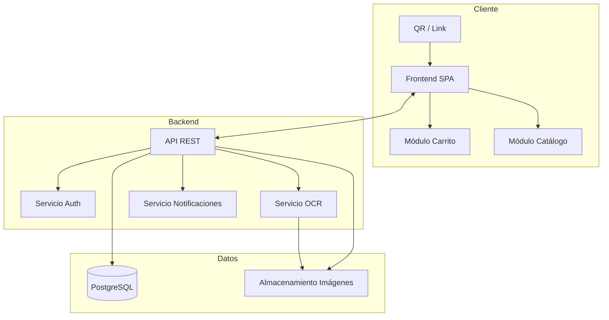
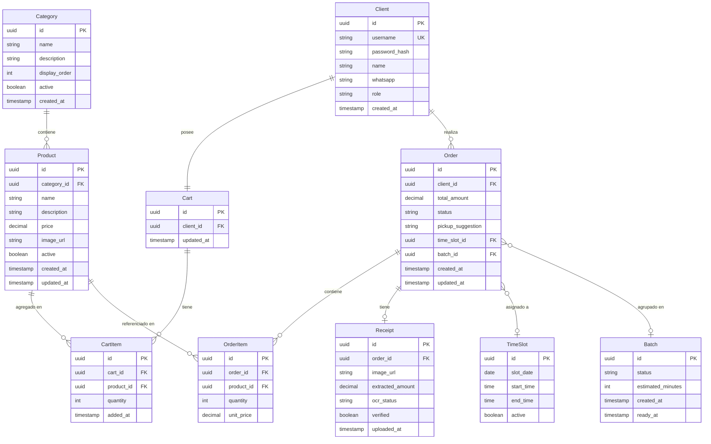

# Documento de Diseño - Sistema de Pedidos de Empanadas

## Overview

Sistema web progresivo (PWA-ready) para gestionar pedidos de un negocio de empanadas, extensible a otros productos alimenticios. Los clientes acceden vía QR/link, navegan un catálogo organizado por categorías, arman un carrito de compras, pagan por transferencia bancaria (con verificación automática por OCR) y coordinan el retiro con el administrador.

La arquitectura es cliente-servidor con:
- Frontend móvil-first (SPA) para clientes y panel de administración
- Backend API REST
- Base de datos relacional
- Servicio OCR para verificación de pagos
- Sistema de notificaciones en tiempo real

## Architecture

### Diagrama de Alto Nivel



### Decisiones Arquitectónicas

1. **SPA con API REST**: Separación clara frontend/backend. El frontend es una SPA liviana optimizada para móvil. El backend expone una API REST stateless.

2. **PostgreSQL**: Base de datos relacional para integridad referencial entre productos, categorías, carritos, pedidos y clientes. Soporte nativo JSON para flexibilidad futura.

3. **Catálogo extensible por categorías**: El modelo de datos usa una tabla de categorías separada, permitiendo agregar nuevos tipos de productos (bebidas, postres, etc.) sin cambios estructurales.

4. **Carrito del lado servidor**: El carrito se persiste en el backend asociado a la sesión del cliente, permitiendo continuidad entre dispositivos y evitando pérdida de datos si se cierra el navegador.

5. **OCR como servicio desacoplado**: El procesamiento OCR se ejecuta de forma asíncrona para no bloquear el flujo del pedido. Se puede reemplazar el proveedor sin afectar el resto del sistema.

## Components and Interfaces

### Frontend (SPA)

| Componente | Responsabilidad |
|---|---|
| CatalogView | Muestra productos agrupados por categoría, permite agregar al carrito |
| CartView | Muestra el carrito, permite modificar cantidades, eliminar items, confirmar pedido |
| OrderStatusView | Muestra estado del pedido activo y historial |
| AdminDashboard | Panel de gestión de pedidos, catálogo, franjas horarias |
| AuthView | Registro e inicio de sesión |

### Backend API

| Endpoint | Método | Descripción |
|---|---|---|
| `/api/auth/register` | POST | Registro de cliente |
| `/api/auth/login` | POST | Inicio de sesión |
| `/api/categories` | GET/POST/PUT/DELETE | CRUD categorías |
| `/api/products` | GET/POST/PUT/DELETE | CRUD productos |
| `/api/cart` | GET/POST/PUT/DELETE | Gestión del carrito |
| `/api/cart/items` | POST/PUT/DELETE | Agregar/modificar/eliminar items del carrito |
| `/api/orders` | GET/POST | Listar pedidos, confirmar carrito como pedido |
| `/api/orders/:id/receipt` | POST | Subir comprobante de pago |
| `/api/orders/:id/status` | PUT | Cambiar estado (admin) |
| `/api/admin/time-slots` | GET/POST/PUT/DELETE | Gestión franjas horarias |
| `/api/admin/batches` | GET/POST/PUT | Gestión de lotes |

### Servicios Internos

| Servicio | Responsabilidad |
|---|---|
| AuthService | Registro, login, JWT, hash de contraseñas |
| CatalogService | CRUD productos y categorías |
| CartService | Gestión del carrito (agregar, quitar, modificar cantidades, calcular totales) |
| OrderService | Creación de pedidos desde carrito, cambios de estado |
| PaymentService | Subida de comprobantes, invocación OCR, verificación de montos |
| OCRService | Extracción de montos desde imágenes de comprobantes |
| NotificationService | Notificaciones de cambios de estado a clientes |
| TimeSlotService | Gestión de franjas horarias y asignación |
| BatchService | Agrupación de pedidos en lotes |

## Data Models

### Diagrama Entidad-Relación



### Descripción de Modelos Clave

**Cart / CartItem**: El carrito es una entidad persistente asociada 1:1 con cada cliente. Los CartItem referencian productos con cantidad. Al confirmar, se "vacía" el carrito y se crea un Order con OrderItems (copiando el precio actual para evitar inconsistencias si el precio cambia después).

**Category**: Permite organizar productos por tipo. Inicialmente habrá una categoría "Empanadas", pero el sistema soporta agregar "Bebidas", "Postres", etc. sin migraciones.

**Order**: Tiene estados: `pending` → `accepted` → `ready` → `delivered` (o `rejected`). El status del pago se gestiona via Receipt.

**OrderItem.unit_price**: Se copia el precio al momento de la orden para preservar integridad histórica.


## Correctness Properties

*Una propiedad es una característica o comportamiento que debe cumplirse en todas las ejecuciones válidas de un sistema — esencialmente, una declaración formal sobre lo que el sistema debe hacer. Las propiedades sirven como puente entre especificaciones legibles para humanos y garantías de correctitud verificables por máquinas.*

### Property 1: Round-trip de creación de producto

*Para cualquier* producto con datos válidos (nombre, descripción, precio, imagen, categoría), al crearlo y luego consultarlo, el sistema debe devolver exactamente los mismos datos almacenados.

**Validates: Requirements 1.2, 1.3**

### Property 2: Solo productos activos visibles para clientes

*Para cualquier* conjunto de productos (algunos activos, algunos inactivos), la vista del cliente debe contener exclusivamente los productos marcados como activos.

**Validates: Requirements 1.6**

### Property 3: Eliminación remueve del catálogo

*Para cualquier* producto existente en el catálogo, al eliminarlo, una consulta posterior no debe incluir ese producto en los resultados.

**Validates: Requirements 1.5**

### Property 4: Round-trip de registro de cliente

*Para cualquier* conjunto de datos de registro válidos (nombre, WhatsApp 10-15 dígitos, username único, contraseña), al registrar y luego autenticar con las mismas credenciales, el acceso debe ser exitoso.

**Validates: Requirements 3.2**

### Property 5: Acceso determinado por validez de sesión

*Para cualquier* cliente, el acceso sin credenciales es permitido si y solo si existe una sesión activa (no expirada) para ese cliente en ese dispositivo.

**Validates: Requirements 3.3, 3.4**

### Property 6: Credenciales incorrectas son rechazadas

*Para cualquier* par (username, contraseña) donde la contraseña no coincide con el hash almacenado para ese username, el sistema debe rechazar el acceso.

**Validates: Requirements 3.5**

### Property 7: Validación de WhatsApp

*Para cualquier* string, el sistema debe aceptarlo como número de WhatsApp si y solo si contiene entre 10 y 15 dígitos.

**Validates: Requirements 3.6**

### Property 8: Unicidad de username

*Para cualquier* par de intentos de registro con el mismo nombre de usuario, el segundo debe ser rechazado.

**Validates: Requirements 3.7**

### Property 9: Agregar producto al carrito

*Para cualquier* producto activo del catálogo, al agregarlo al carrito, el carrito debe contener ese producto con cantidad 1.

**Validates: Requirements 4.1**

### Property 10: Invariante de cálculo del carrito

*Para cualquier* carrito con N items, el monto total debe ser siempre igual a la suma de (precio_unitario × cantidad) de cada item presente en el carrito, independientemente de las operaciones de agregar, modificar o eliminar que se hayan realizado.

**Validates: Requirements 4.2, 4.3, 4.5**

### Property 11: Confirmación de carrito crea pedido equivalente

*Para cualquier* carrito no vacío, al confirmarlo, debe crearse un pedido que contenga exactamente los mismos productos, cantidades y monto total que el carrito tenía al momento de la confirmación.

**Validates: Requirements 4.6**

### Property 12: Persistencia del carrito en sesión

*Para cualquier* secuencia de operaciones sobre el carrito (agregar, modificar, eliminar), el estado del carrito debe mantenerse intacto entre navegaciones dentro de la misma sesión.

**Validates: Requirements 4.9**

### Property 13: Verificación de pago por comparación de montos

*Para cualquier* par (monto_extraído, monto_pedido), el pago es marcado como verificado si y solo si monto_extraído == monto_pedido. En caso contrario, se genera una notificación de discrepancia al administrador.

**Validates: Requirements 5.4, 5.5, 5.6**

### Property 14: Estado inicial de pedido confirmado

*Para cualquier* pedido recién confirmado por un cliente, su estado inicial debe ser "pendiente".

**Validates: Requirements 6.1**

### Property 15: Transiciones de estado válidas del pedido

*Para cualquier* pedido, las transiciones de estado deben seguir la máquina de estados definida: pendiente → aceptado, pendiente → rechazado, aceptado → listo. Cualquier transición fuera de este grafo debe ser rechazada.

**Validates: Requirements 6.3, 6.4, 6.5**

### Property 16: Máximo 4 franjas horarias por día

*Para cualquier* día, el sistema no debe permitir crear más de 4 franjas horarias. Un intento de crear la quinta debe ser rechazado.

**Validates: Requirements 7.1**

### Property 17: Asignación a franja más cercana

*Para cualquier* sugerencia horaria del cliente y conjunto de franjas disponibles, la franja asignada debe ser aquella cuyo horario de inicio está más cercano (en valor absoluto) a la sugerencia.

**Validates: Requirements 7.6**

### Property 18: Pedidos aceptados en modo franjas tienen franja asignada

*Para cualquier* pedido con estado "aceptado" mientras el modo franjas está activo, el pedido debe tener una franja horaria asignada.

**Validates: Requirements 7.4**

### Property 19: Notificación de lote a todos los clientes

*Para cualquier* lote con N pedidos de N clientes distintos, al marcar el lote como "listo", cada uno de los N clientes debe recibir una notificación.

**Validates: Requirements 8.5**

### Property 20: Cálculo de hora estimada del lote

*Para cualquier* lote al que se le asigna N minutos de preparación, la hora estimada de disponibilidad registrada debe ser igual al momento de la asignación + N minutos.

**Validates: Requirements 8.3**

### Property 21: Historial completo de pedidos del cliente

*Para cualquier* cliente que haya realizado K pedidos, su historial debe contener exactamente esos K pedidos con sus estados actuales.

**Validates: Requirements 9.3**

### Property 22: Contraseñas nunca almacenadas en texto plano

*Para cualquier* contraseña almacenada en el sistema, el valor en base de datos no debe ser igual al texto plano original de la contraseña.

**Validates: Requirements 10.1**

### Property 23: Autorización por rol

*Para cualquier* request a un endpoint de administración, el acceso es permitido si y solo si el usuario autenticado tiene rol de administrador. Clientes autenticados deben recibir denegación de acceso.

**Validates: Requirements 10.2, 10.3**

## Error Handling

### Errores del Cliente

| Situación | Respuesta del Sistema |
|---|---|
| Carrito vacío al confirmar | Mensaje: "Debés agregar al menos un producto" |
| Credenciales incorrectas | Mensaje: "Usuario o contraseña incorrectos" (sin revelar cuál) |
| WhatsApp inválido | Mensaje: "El número debe tener entre 10 y 15 dígitos" |
| Username duplicado | Mensaje: "Ese nombre de usuario ya está en uso" |
| Sesión expirada | Redirigir a login con mensaje amable |
| Producto no disponible (race condition) | Mensaje: "Este producto ya no está disponible", remover del carrito |

### Errores del Administrador

| Situación | Respuesta del Sistema |
|---|---|
| Intentar crear 5ta franja horaria | Mensaje: "Máximo 4 franjas por día" |
| Transición de estado inválida | HTTP 422 con detalle de transiciones permitidas |

### Errores del Sistema

| Situación | Respuesta del Sistema |
|---|---|
| OCR no puede leer comprobante | Marcar como "revisión manual", notificar admin |
| OCR monto no coincide | Notificar admin con ambos montos, no auto-verificar |
| Fallo de conexión a BD | HTTP 503, reintentar con backoff exponencial |
| Imagen demasiado grande | HTTP 413, indicar tamaño máximo permitido |
| Error inesperado | HTTP 500 genérico al cliente, log detallado en servidor |

### Estrategia General

- Validaciones de input en el frontend (feedback inmediato) Y en el backend (seguridad)
- Los errores de negocio retornan HTTP 4xx con mensajes descriptivos en español
- Los errores del sistema retornan HTTP 5xx sin exponer detalles internos
- Logging estructurado de todos los errores con correlación por request ID

## Testing Strategy

### Testing Dual: Unit Tests + Property-Based Tests

El sistema usa una estrategia de testing dual:

- **Unit tests**: Verifican ejemplos específicos, edge cases y condiciones de error
- **Property-based tests**: Verifican propiedades universales con inputs generados aleatoriamente

Ambos son complementarios y necesarios para cobertura completa.

### Librería de Property-Based Testing

**Librería**: [fast-check](https://github.com/dubzzz/fast-check) (JavaScript/TypeScript)

Configuración mínima: 100 iteraciones por test de propiedad.

Cada test de propiedad debe incluir un comentario con referencia al documento de diseño:
```
// Feature: empanada-ordering-system, Property 10: Invariante de cálculo del carrito
```

### Unit Tests (Ejemplos y Edge Cases)

Los unit tests cubren:
- Flujo de acceso por QR/link (req 2.1, 2.2)
- Formulario de registro muestra campos correctos (req 3.1)
- Confirmación de pedido muestra solicitud de horario (req 4.7)
- Datos bancarios se muestran post-pedido (req 5.1)
- Alternar entre modo franjas y lotes (req 8.4)
- Dirección de retiro visible cuando pedido está listo (req 9.2)
- Edge case: OCR falla → notificación manual (req 5.7)
- Edge case: carrito vacío → rechazo (req 4.8)

### Property-Based Tests

Cada propiedad del diseño (Properties 1-23) se implementa como un test de propiedad individual con fast-check:

| Property | Generadores necesarios |
|---|---|
| 1: Round-trip producto | Producto arbitrario con strings, precio decimal positivo, UUID categoría |
| 4: Round-trip registro | Datos de registro con WhatsApp 10-15 dígitos, username alfanumérico |
| 7: Validación WhatsApp | Strings arbitrarios (válidos e inválidos) |
| 9: Agregar al carrito | Producto activo arbitrario |
| 10: Cálculo carrito | Lista arbitraria de (producto, cantidad) con precios decimales positivos |
| 11: Confirmar carrito | Carrito no vacío arbitrario |
| 13: Verificación pago | Par de decimales (monto_extraído, monto_pedido) |
| 15: Transiciones estado | Estado actual + acción arbitraria |
| 16: Máximo franjas | Lista de 5+ franjas para un mismo día |
| 17: Franja más cercana | Hora sugerida + lista de franjas horarias |
| 22: Hash contraseña | Strings arbitrarios como contraseñas |
| 23: Autorización rol | Request arbitrario + usuario con rol aleatorio |

### Estructura de Tests

```
tests/
├── unit/
│   ├── catalog.test.ts
│   ├── cart.test.ts
│   ├── auth.test.ts
│   ├── orders.test.ts
│   ├── payments.test.ts
│   └── timeslots.test.ts
├── property/
│   ├── catalog.property.ts
│   ├── cart.property.ts
│   ├── auth.property.ts
│   ├── orders.property.ts
│   ├── payments.property.ts
│   └── timeslots.property.ts
└── integration/
    ├── order-flow.test.ts
    └── payment-flow.test.ts
```

### Cobertura Esperada

- Lógica de negocio (servicios): >90% via property tests
- Validaciones de input: 100% via property tests
- Endpoints API: Integration tests con supertest
- UI Components: Unit tests con testing-library (ejemplos específicos)
